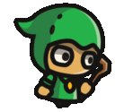

# Описание Игры

Принцип игры точно такой же как в игре Pacman. Игровое поле представляет собой квадрат и состоит из 13x11 элементарных единиц (квадратов). Квадрат может как временно, так и постоянно содержать игрока, стену, монетку, монстра и т.д.

Отсчет начинается с левого верхнего угла (x - 0, y -0). Вы управляете одним персонажем, который может только передвигаться по карте и собирать монетки

# Механика игры

- Игра управляется внутреигровыми часами, за элементарную секунду берется одна итерация игры - **tick**. За **1 tick** игрок может поменять свою позицию на одну клетку.
- Вы управляете только персонажем, который может передвигаться по свободным клеткам, собирать монеты и фичи. Цель игры всегда одна - собрать все монетки (для песочницы) или собрать больше монеток чем соперник (для арены).
- Фича ("Кинжал", "Бонус" и т.д.) выпадает только на свободной клетке (т.е. фича не может появиться в одной клетке с игроком, монстром, другой фичей, монеткой или ящиком).

# Элементы игры

## Игрок

Может передвигаться по карте. Главный персонаж игры, управляемый ботом. Игрок может выполнить только одно действие - передвижение ("left", "right", "up", "down", "stay")

## Монстр

Может передвигаться по карте. Не делает ничего полезного, кроме как достает игрока в песочнице. Попав в одну клетку с игроком, убивает его. Может быть убит фичей "Кинжал".

## Монетка

Главная цель игры. Если игрок находится в одной клетке с монеткой, то монетка пропадает и зачисляется игроку.

Фичи появляются случайным образом на карте, и пропадают, если игрок не поднимает их.

## Фича "Кинжал"

При столкновении с монстром игрок убивает монстра. Фича действует 15 тиков, и пропадает через 15 тиков, если ее никто не подбирает.

## Фича "Бонус"

Удваивает количество очков получаемое за монетки. Фича действует 30 тиков, и пропадает через 15 тиков, если ее никто не подбирает.

# Технические правила

- Основой бота является бесконечный цикл, на каждой итерации которого ваш бот должен обработать входную информацию с параметрами игры и принять решение о дальнейшем действии.
- Программа должна сначала прочитать все параметры игры (передаются через **stdin**).
- После этого необходимо отдать движение бота в **stdout** ("запринтить" текст с командой)
- На каждую итерацию дается **250 мс**
- Если ваша программа не успевает принять решение за это время или не выдает никаких результатов совсем игра завершается поражением для вас.

# Порядок хода

1. Убираем с карты всех, кто умер или был подобран игроком (монстр, игрок, фича, монетка)
2. Игроки получают состояние карты
3. Ход монстра
4. Проверяем, есть ли столкновение монстра с игроком
5. Проверяем, есть ли столкновение игрока с монеткой или фичей
6. Ход игрока
